# 智汀家庭云

智汀智能生态，立项于2021年，结合国内智能家居各厂商软件特点，研发“智汀智能生态”，并对该生态系统全面开源，为国内首个采用智能家居系统全生态开源协议（Apache License, Version 2.0）的软件。

## 快速入门

您可以无须购买硬件，在任何电脑上 [使用虚拟机运行智汀家庭云](docs/tutorial/virtual-machine-quickstart.md) 。

如果您机器上安装有 docker 与 docker-compose 环境，可按照 [使用 Docker 运行智汀家庭云](docs/tutorial/docker-quickstart.md) 的步骤体验智汀家庭云的基本功能。

智汀家庭云是一个开源项目，如果如果您熟悉 go 编程语言，想参与到项目的开发中，可以访问 [开发环境搭建](docs/tutorial/development-quickstart.md) 。

智汀家庭云提供插件系统支持第三方设备接入，如果您的设备不在我们的支持列表，可以参考 [开发您的第一个插件](docs/tutorial/plugin-quickstart.md)了解插件开发相关内容。

## 开发指南

* [架构概述](docs/guide/architecture.md)
* [用户模块](docs/guide/user-module.md)
* [用户认证与第三方授权](docs/guide/authenticate.md)
* [设备模块](docs/guide/device-module.md)
* [设备控制场景](docs/guide/device-scene.md)
* [插件模块](docs/guide/plugin-module.md)
* [HTTP API 接口规范](docs/guide/http-api.md)
* [WebSocket API 消息定义](docs/guide/web-socket-api.md)

## 功能介绍

   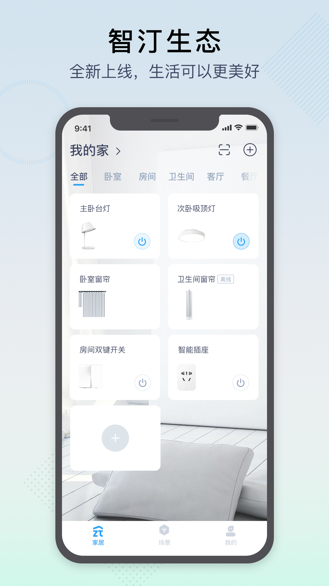
   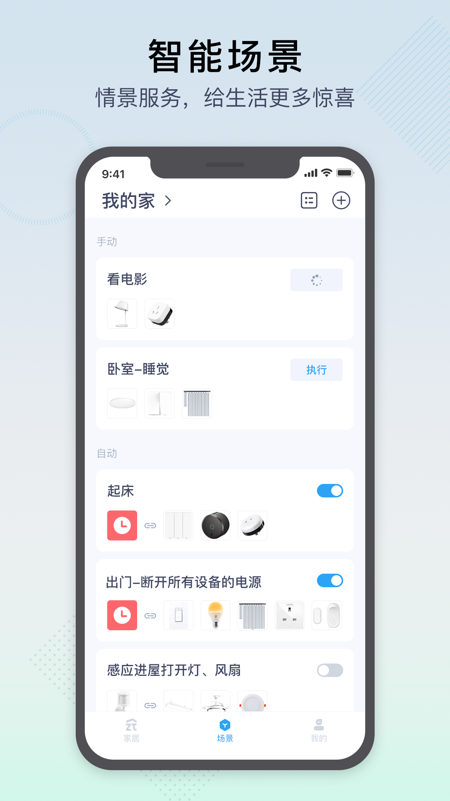
   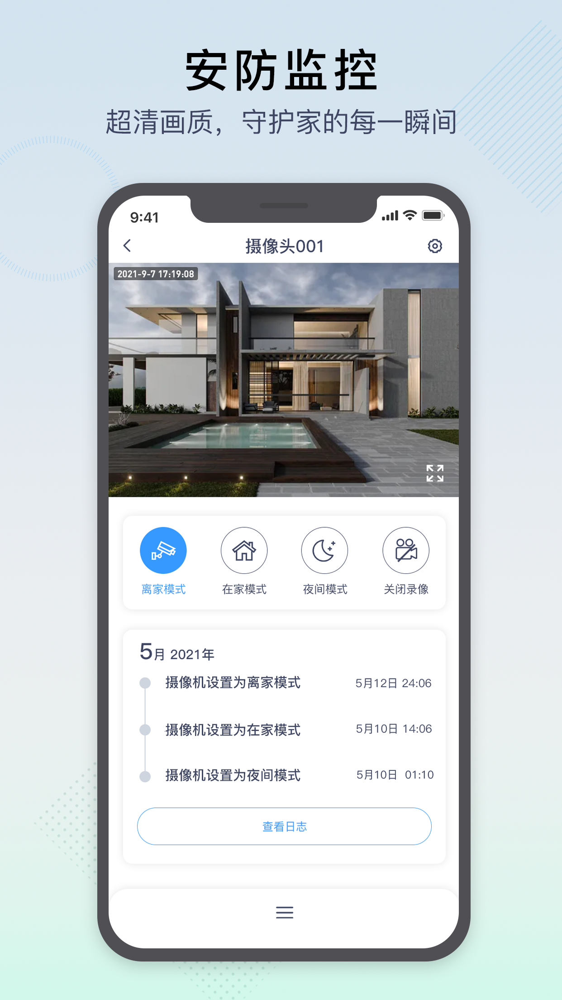
   
   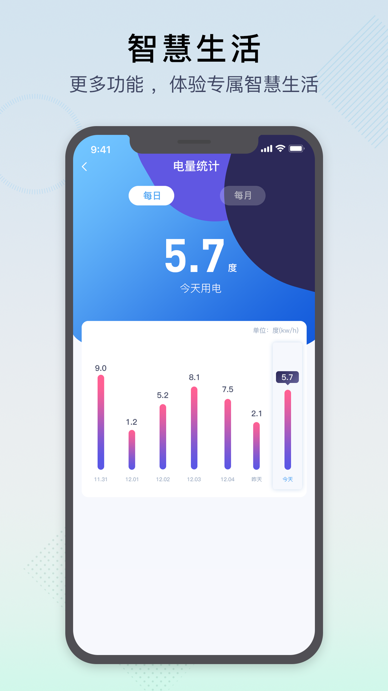
   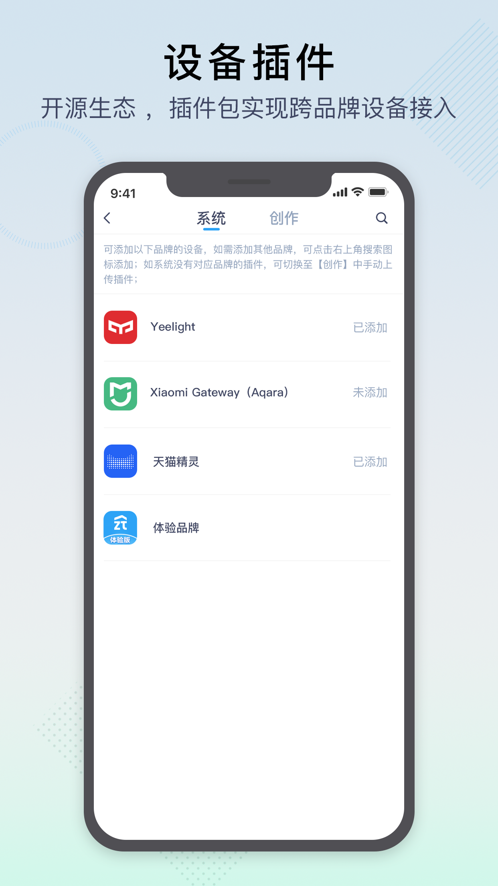

## 系统组成
智汀智能生态，包括智慧中心、插件包、智汀云、PC终端、APP终端五大部分组成，如下图：

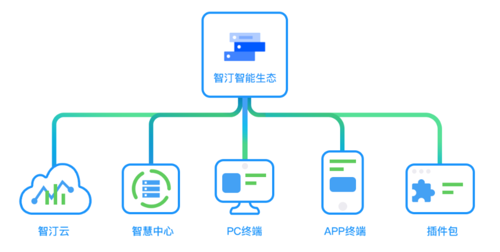

图.智汀智能生态组成

## 核心一：智慧中心

“智慧中心”为“智汀智能生态”的核心软件之一，提供局域网内对智能设备的控制管理等，核心功能包括：

1.智能设备插件包的安装/更新/移除；

2.智能设备发现、连接；

3.智能设备的控制；

4.智能设备实时状态交互

5.智能设备事件交互；

6.智能场景配置、交互；

7.数据自动备份、恢复；

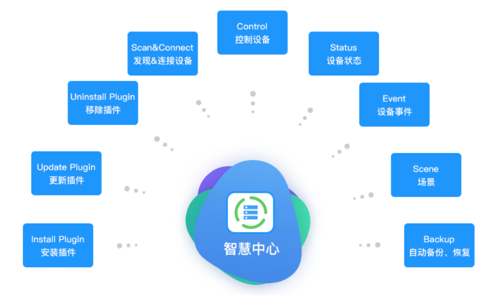

图.智慧中心功能图

## 核心二：插件包
“智能设备插件包”为“智汀智能生态”的另一核心组成，根据市场主流品牌主流设备封装的插件包，并将在广度、深度不断新增、迭代更新。程序员可以根据插件包的开发规范，自行新增/扩展插件包。

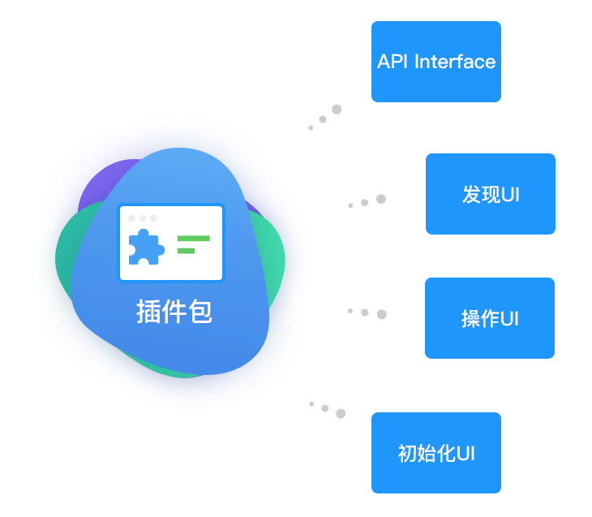

图.插件包构成

## 核心三：终端应用
智汀智能生态提供PC版终端、iOS版终端、安卓版终端，实现智能家居功能的操作实现。

   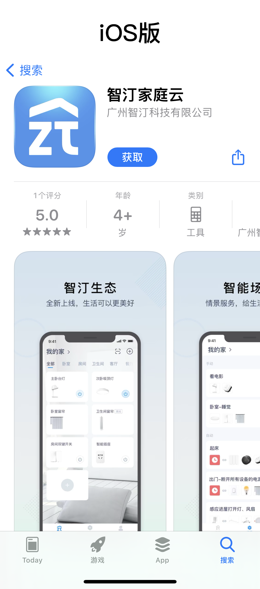&nbsp;&nbsp;&nbsp;&nbsp;
   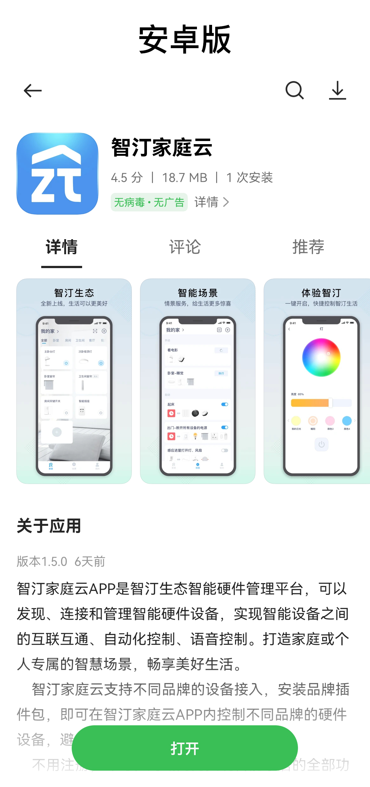

图.iOS版、安卓版应用

## 核心四：智汀云
智汀云，云端服务支持，支持两种模式：

1.采用中转代理技术，辅助用户在外网环境下对智慧中心的远程操作，通过智汀云，用户终端操作可以无感切换局域网以及外网的功能实现；

2.支持无智慧中心模式下，用户终端通过智汀云，对智能设备进行操作。

## 系统交互架构
智汀智能生态，提供灵活的网络环境操作。

1.用户可以仅采用局域网的模式进行：

步骤1：部署智慧中心，接入局域网；

步骤2： APP终端在相同局域网内，发现并连接智慧中心；

步骤3：安装产品插件包；

步骤4：通过智慧中心连接智能设备，包括直连、发现、云对云接入方式进行发现；

步骤5：APP终端局域网内智能设备的控制、场景配置等；

2.用户也可以接入智汀云辅助户外的操作:：

步骤1：APP终端绑定智汀云，实现智慧中心的注册；

步骤2：APP自动通过网络环境，自动在局域网/公网模式下切换控制智能设备等操作。

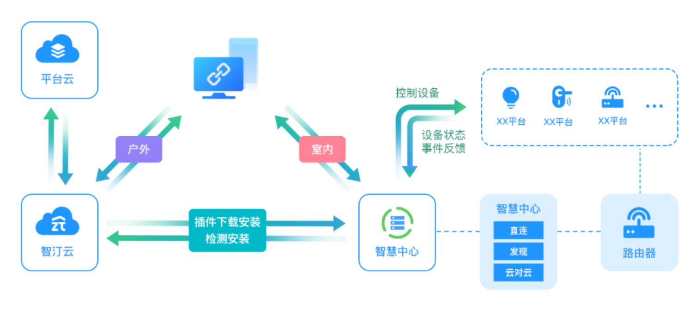

图.室内、户外交互简图

## 应用领域
智汀智能生态，从全屋智能扩展到空间智能化， 将智慧家庭的应用理念扩充至智慧家庭(家居/别墅)、智慧酒店(酒店/公寓)、智慧物业、智慧办公等。

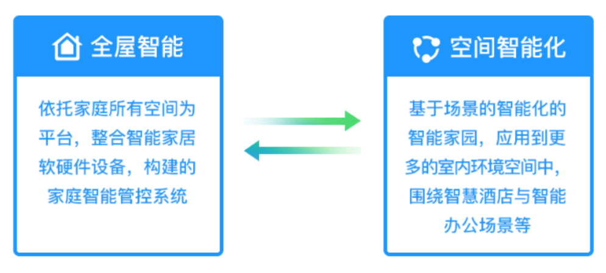

图.空间延伸

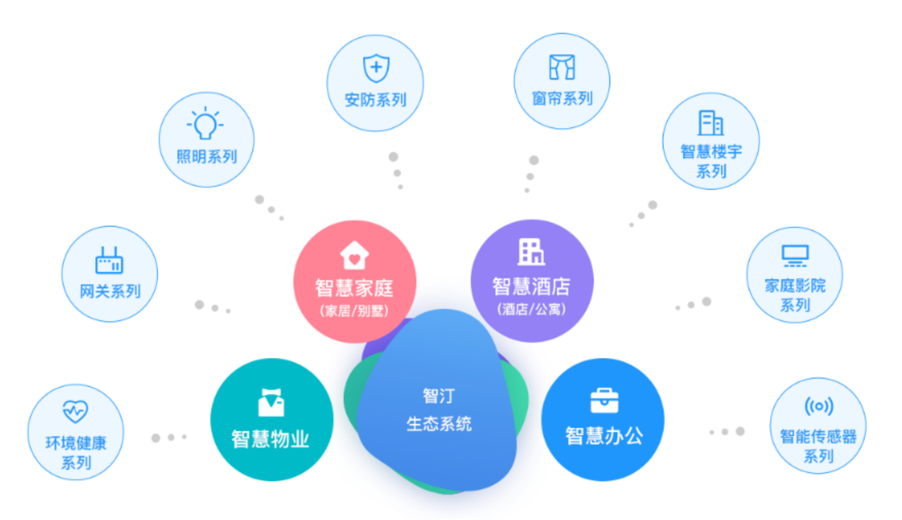

图.8大产品矩阵支撑四大空间

## 软件开源
1. Git Hub

| 名称                 | URL                                                                                                      | 描述        |
|:-------------------|----------------------------------------------------------------------------------------------------------|-----------|
| smartassistant     | [https://github.com/zhiting-tech/smartassistant](https://github.com/zhiting-tech/smartassistant)         | Golang源码  |
| smartassistant-vue | [https://github.com/zhiting-tech/smartassistant-vue](https://github.com/zhiting-tech/smartassistant-vue) | Web源码     |
| sa-ios-sdk         | [https://github.com/zhiting-tech/sa-ios-sdk](https://github.com/zhiting-tech/sa-ios-sdk)                 | IOS源码     |
| sa-android-sdk     | [https://github.com/zhiting-tech/sa-android-sdk](https://github.com/zhiting-tech/sa-android-sdk)         | Android源码 |

2. gitee

| 名称                 | URL                                                                                                    | 描述        |
|:-------------------|--------------------------------------------------------------------------------------------------------|-----------|
| smartassistant     | [https://gitee.com/zhiting-tech/smartassistant](https://gitee.com/zhiting-tech/smartassistant)         | Golang源码  |
| smartassistant-vue | [https://gitee.com/zhiting-tech/smartassistent-vue](https://gitee.com/zhiting-tech/smartassistent-vue) | Web源码     |
| sa-ios-sdk         | [https://gitee.com/zhiting-tech/sa-ios-sdk](https://gitee.com/zhiting-tech/sa-ios-sdk)                 | IOS源码     |
| sa-android-sdk     | [https://gitee.com/zhiting-tech/sa-android-sdk](https://gitee.com/zhiting-tech/sa-android-sdk)         | Android源码 |

## 参与项目

您可以通过给我们提交问题反馈、提交合并请求（pull request）或者开发第三方插件的方式参与到项目中。关于参与项目的详细指引请阅读 [如何参与项目](docs/guide/contributing.md) 文档。

## 开源协议

智汀家庭云项目源码基于 [APACHE LICENSE, VERSION 2.0](https://www.apache.org/licenses/LICENSE-2.0) 发布。
