# Mac系统下开发环境搭建
## 前提
1. 系统已经安装etcd。
2. go 1.16。
3. Goland IDE。
4. Postman。
## 克隆项目
```bash
git clone http://gitlab.yctc.tech/zhiting/smartassistant.git
```
### 使用Goland运行项目
使用Goland打开项目，配置GOPROXY。
```
GOPROXY=https://goproxy.cn,direct
```
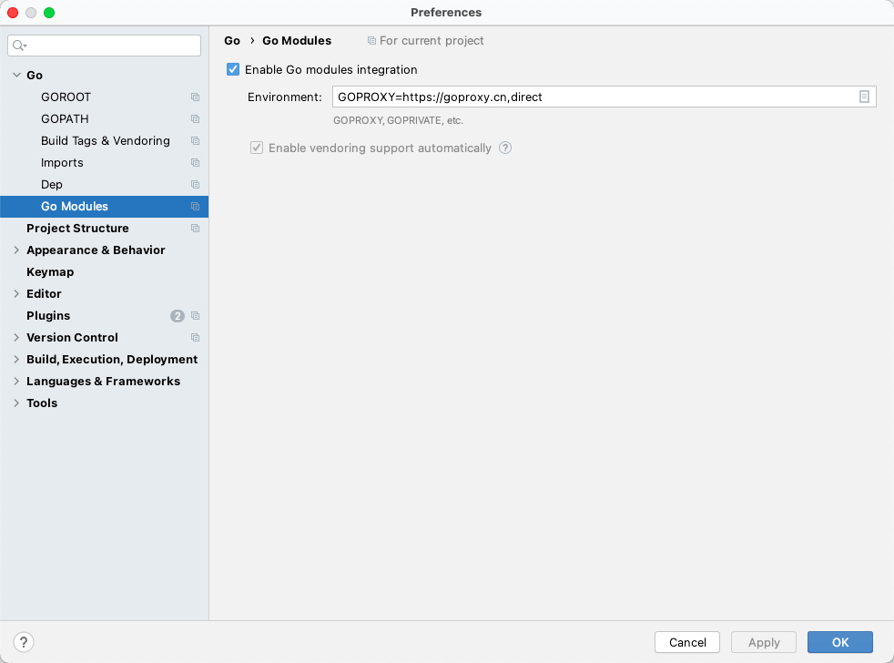

#### 运行smartassistant

拷贝项目下的app.yaml.example到项目根目录,并重命名为app.yaml。
```
cp app.yaml.example app.yaml
```

打开终端创建程序数据存储目录。
```bash
mkdir -p data/zt-smartassistant/data/smartassistant
```
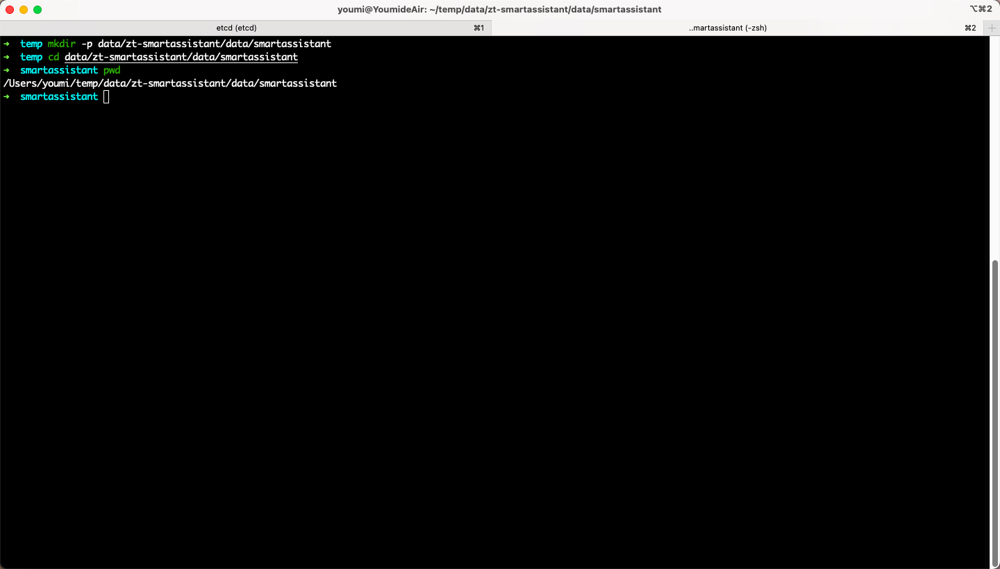

修改配置文件app.yaml中的runtime_path和host_runtime_path，将这个参数改为数据存储目录的绝对路径。
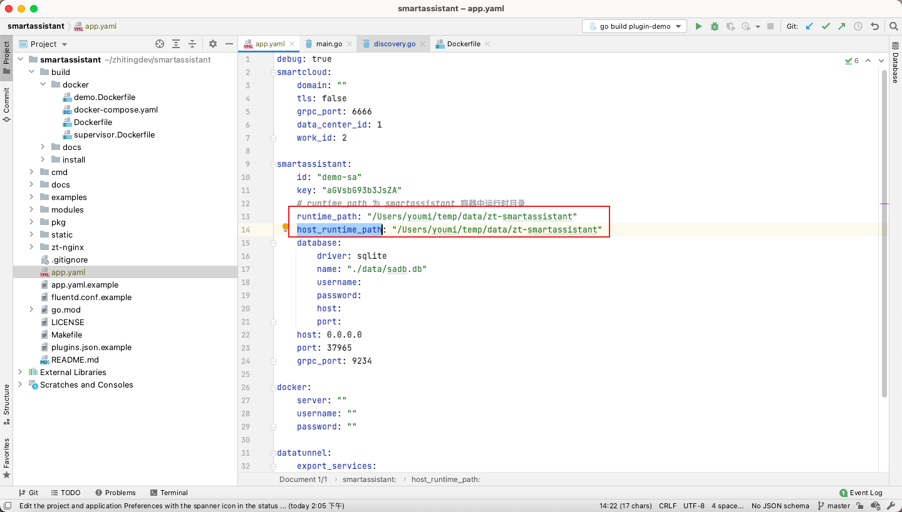

启动Etcd。
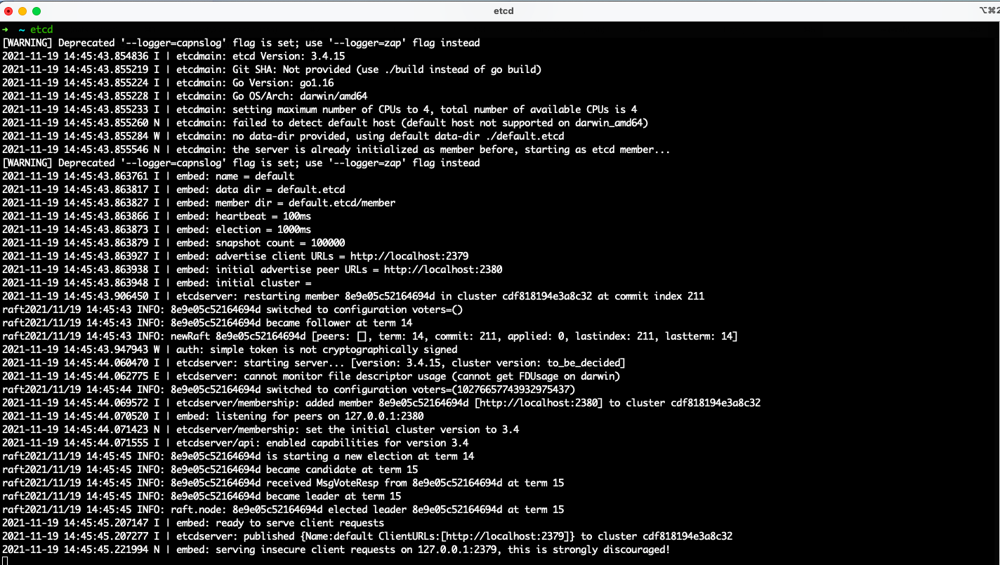

修改项目下modules/plugin/discovery.go文件中的etcd服务器地址。
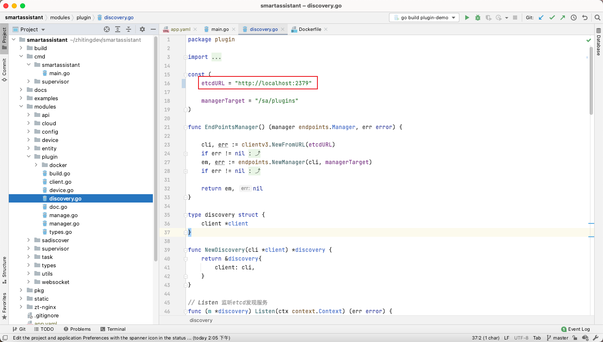

在ide中打开cmd/smartassistant/main.go文件，编辑运行配置。
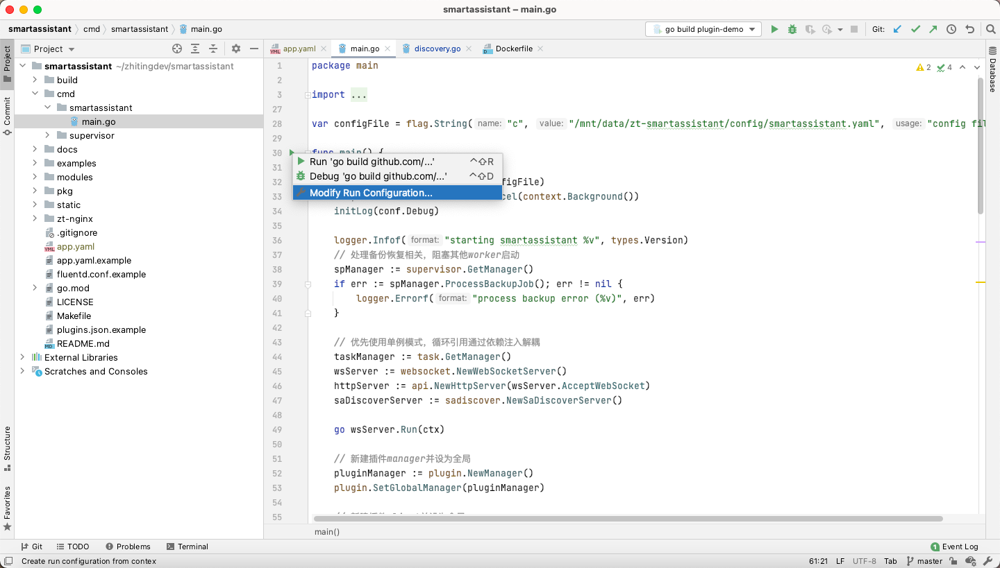
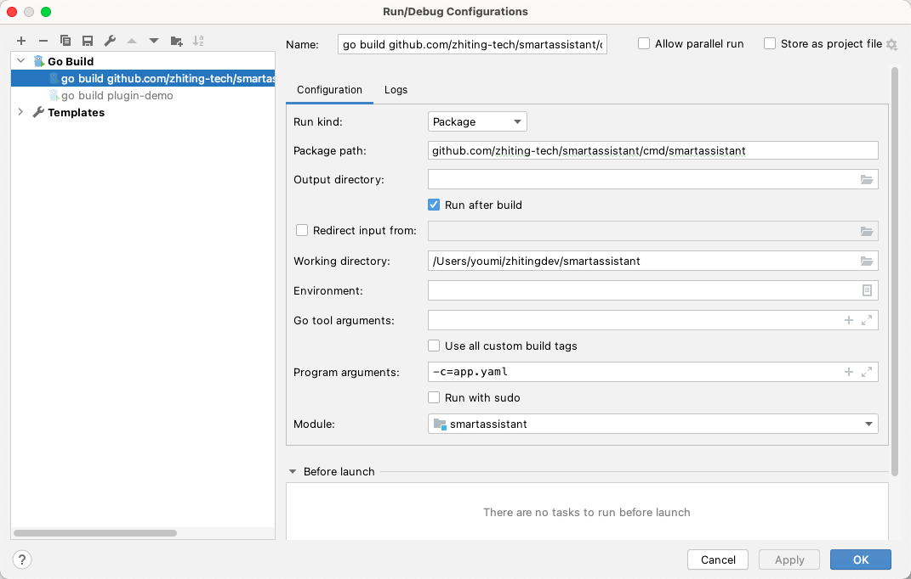
其中，**Program arguments**配置使用-c=app.yaml来指定程序的配置文件。配置完成用点击运行即可。
如果成功运行后打开浏览器 http://localhost:37965/api/check 返回以下内容
```
{"status":0,"reason":"成功","data":{"is_bind":false,"revision":"","version":"latest"}}
```
说明smartassistant成功运行起来了。

#### 运行plugin-demo

使用ide打开examples/plugin-demo/main.go文件，编辑运行配置。
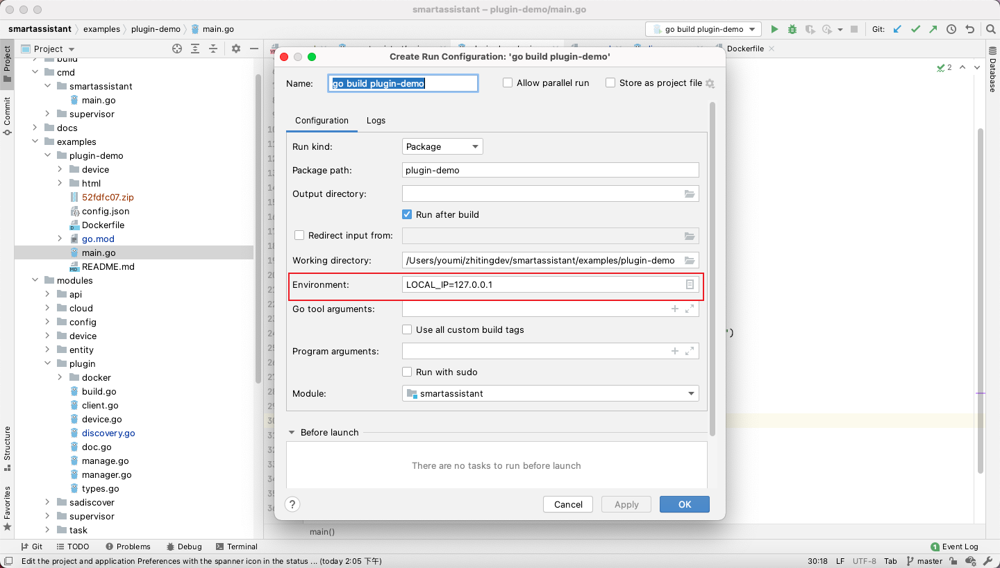
其中，**Environment**配置一个LOCAL_IP的环境变量，如果不指定有可能会获取一个ipv6的ip地址导致smartassistant不能发现插件中的设备。配置完成后点击运行即可。

### 测试过程
根据上述步骤将smartassistant和plugin-demo运行起来后，可以使用postman进行测试。

#### 初始化smartassistant账号

请求方法：POST
请求url： http://localhost:37965/api/devices
请求参数：
``` json
{
    "device": {
        "model": "smart_assistant"
    }
}
```
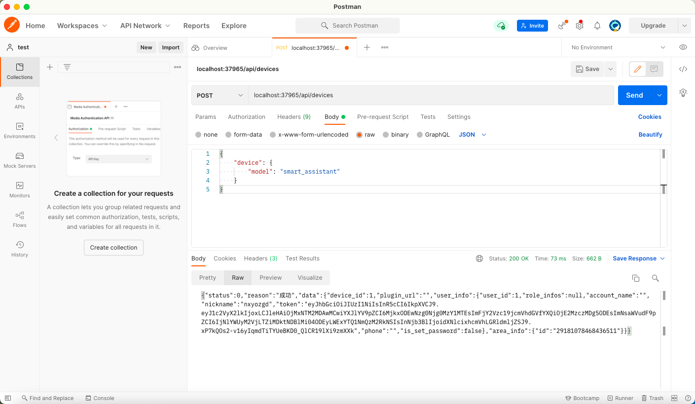

#### 发现插件中的设备
在Postman中创建**WebSocket Request**
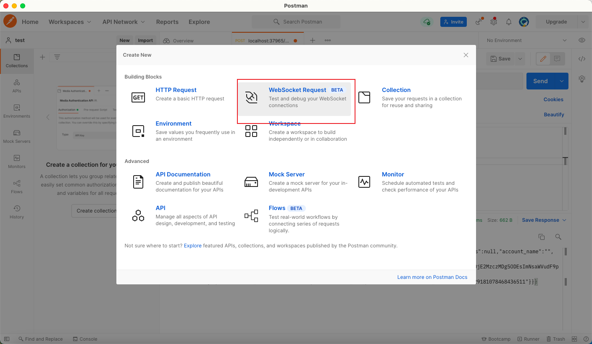

请求url: http://localhost:37965/ws
请求头添加 ```smart-assistant-token```,该值为初始化smartassistant返回的token。
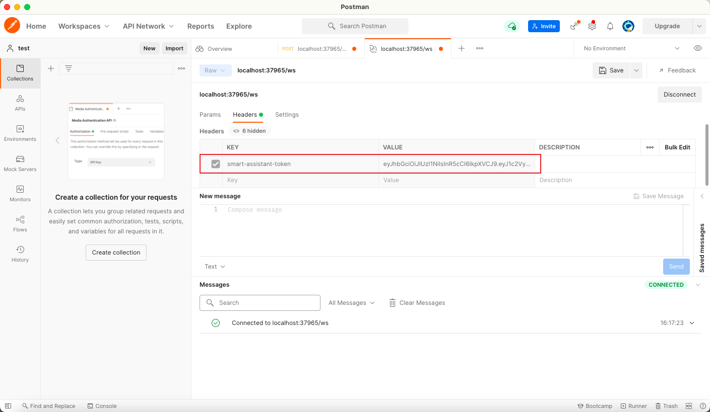

连接成功后，发送以下请求
```json
{
  "ID": 1,
  "Service": "discover"
}
```
即可发现插件中的设备。
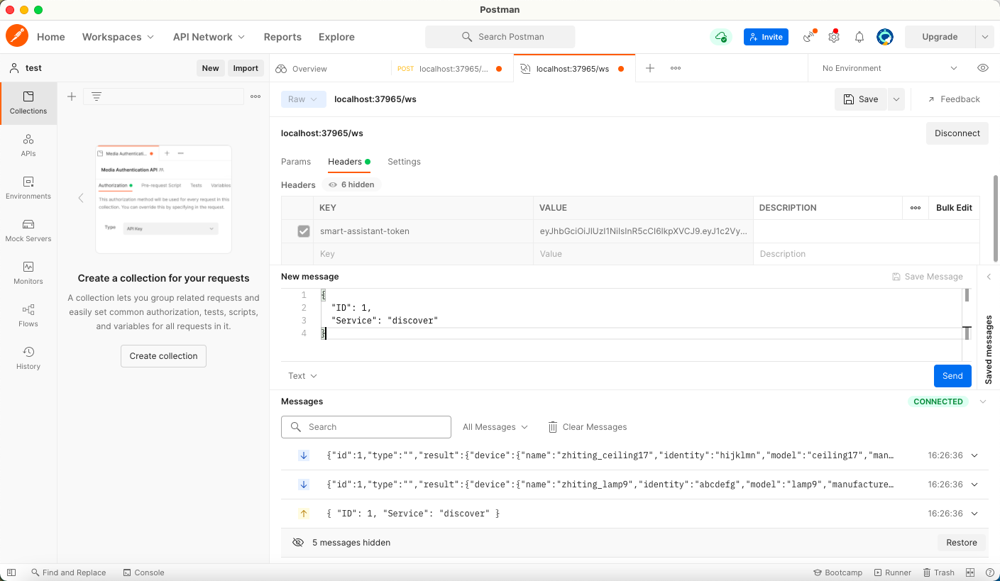

## 常见问题
- **plugin-demo的依赖无法下载？**
  
  修改项目下的examples/plugin-demo/go.mod文件
  将 github.com/zhiting-tech/smartassistant replace 成../../
  ```
  replace github.com/zhiting-tech/smartassistant v1.5.0 => ../../
  ```
  然后在命令行中，cd到plugin-demo目录下执行go mod tidy

- ***smartassistant和plugin-demo都运行起来，但是使用websocket进行设备发现是没有返回数据。**
  
  可以使用```etcdctl get --prefix "/sa/plugins"```命令检查插件是否成功注册到etcd中。如果没有数据，可能是etcd不是本地启动的，导致plugin-demo连不上etcd。检查运行plugin-demo的步骤配置LOCAL_IP环境变量。检查运行smartassistant是否修改了modules/plugin/discovery.go文件中的etcd地址。
  
- **根据快速入门使用docker-compose启动smartassistant无法与本地运行的插件进行通讯？**
  
  由于docker-compose启动的时候使用的host网络，但是host网络只能在linux系统使用[docker host 网络](https://docs.docker.com/network/host/)，可以安装vritual box安装linux虚拟机进行测试。
  


