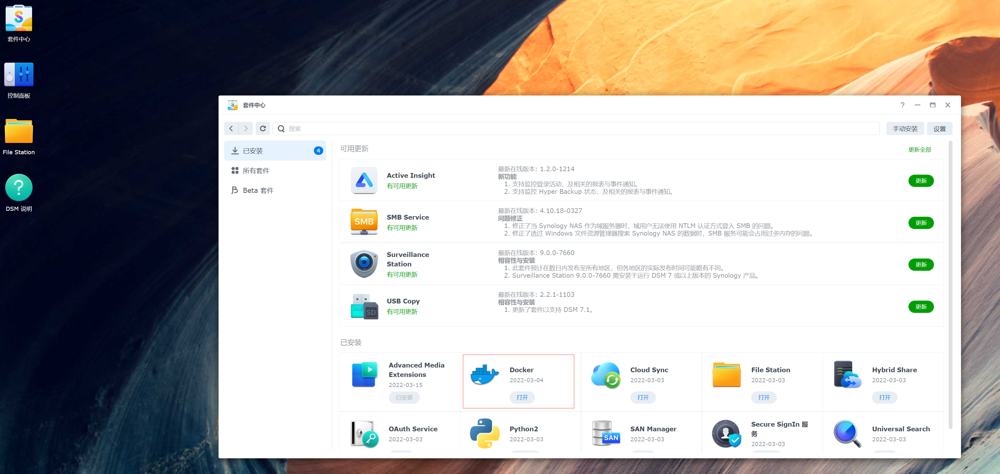
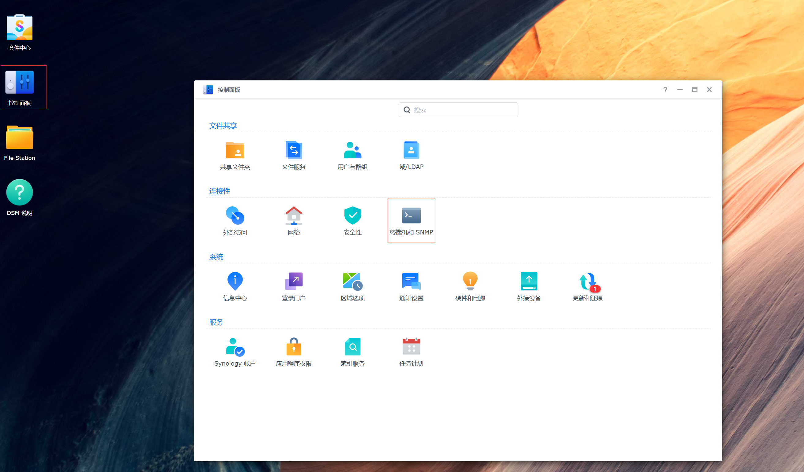
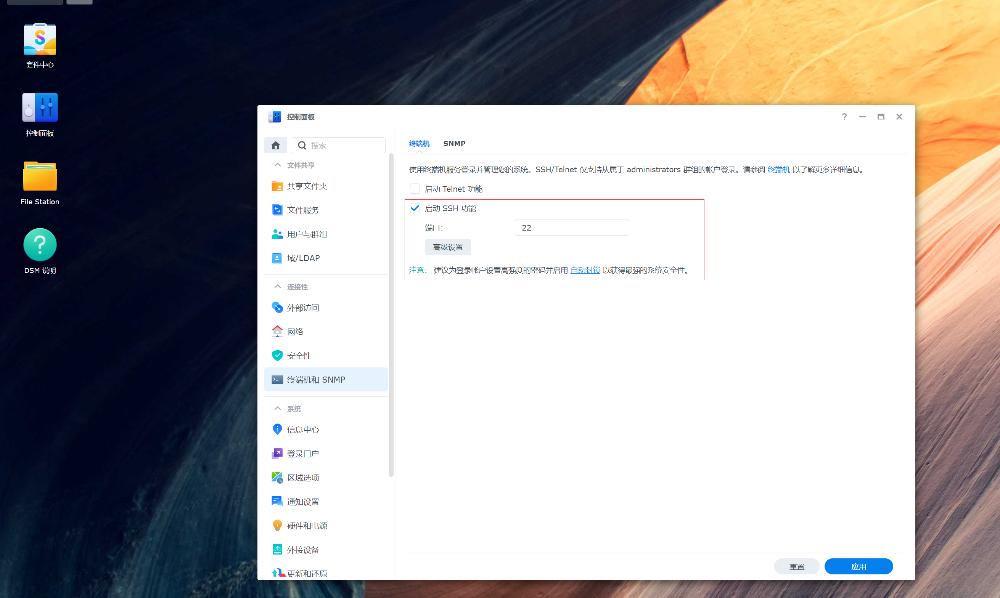
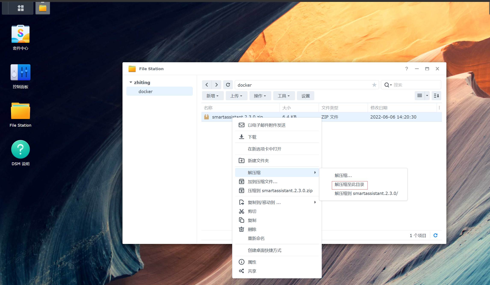
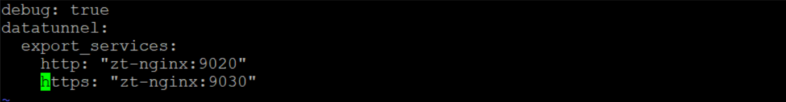
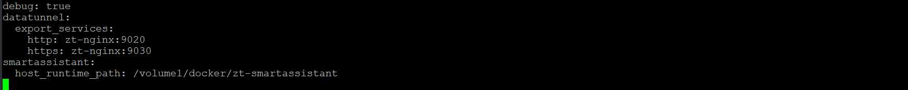
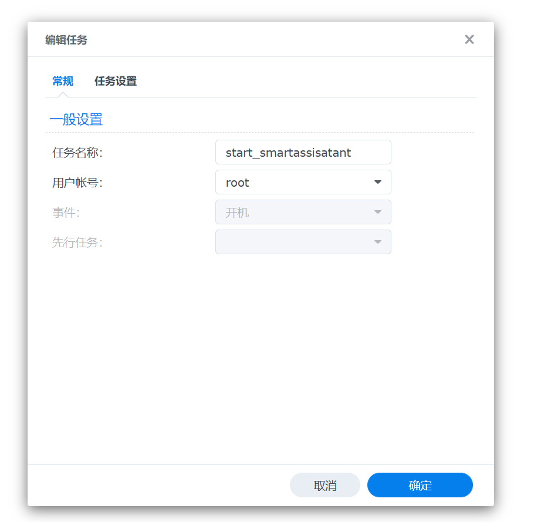
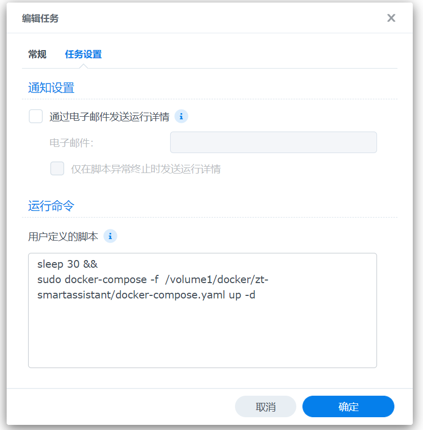
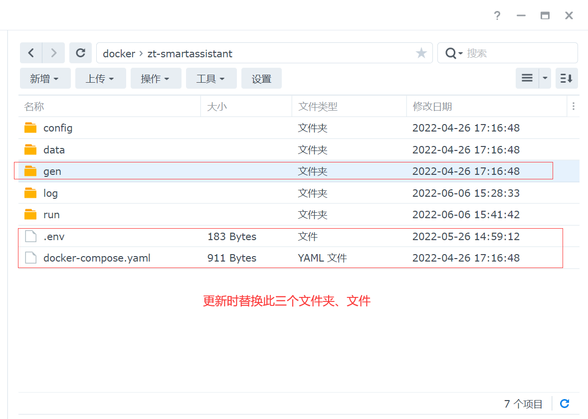
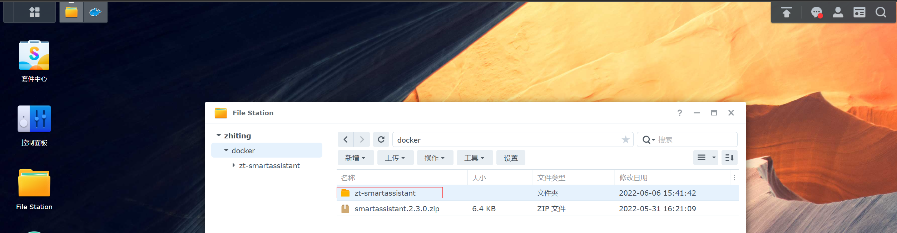

# 群晖运行智汀家庭云
本教程，我们将描述如何在x86群晖下如何安装智汀家庭云。

**重要:** 我们希望您具备以下基本的**linux**命令行操作能力：使用**ssh**登录**linux**服务器，**vim**编辑文本文件，使用**sudo**命令在命令行操作群晖套件中心安装的**docker**、**docker-compose**，若对以上存疑请提前了解后再阅读本教程。

## 环境准备
* 群晖nas
* 套件中心安装docker



* 进入控制面板->终端机启动SSH功能




* 7z(optional)

## 安装及运行智汀家庭云
* 方法1： 
1. 下载[https://github.com/zhiting-tech/smartassistant/releases/download/v2.3.0/smartassistant.2.3.0.zip](https://github.com/zhiting-tech/smartassistant/releases/download/v2.3.0/smartassistant.2.3.0.zip)
2. 进入群晖页面打开**File Station**，选择**docker**文件夹，点击上传**smartassistant.2.3.0.zip**,上传完毕后，在群晖页面右键该压缩包，选择解压缩，解压缩至此目录即可



3. 通过ssh连接群晖nas(通过右上角小工具可查看ip地址)
```bash
cd /volume1/docker/zt-smartassistant
vim config/smartassistant.yaml
```
4. 添加如下配置
```yaml
smartassistant:
    host_runtime_path: /volume1/docker/zt-smartassistant #当前安装目录
```
修改前：



修改后：



`:wq`保存

5. 修改.env 根据实际时区设置TZ e.g `TZ=Asia/Shanghai`
6. 启动
```bash
cd /volume1/docker/zt-smartassistant
sudo docker-compose up -d
```
拉取镜像过程中若发生超时错误请再次输入`sudo docker-compose up -d`运行

* 方法2：
1. 通过ssh连接群晖nas(通过右上角小工具可查看ip地址)
```bash
cd /volume1/docker/
wget https://github.com/zhiting-tech/smartassistant/releases/download/v2.3.0/smartassistant.2.3.0.zip && 7z x smartassistant.2.3.0.zip
cd zt-smartassistant
```
2. 修改config下的配置文件smartassistant.yaml，添加如下配置
```yaml
smartassistant:
    host_runtime_path: /volume1/docker/zt-smartassistant #当前安装目录
```
3. 修改.env 根据实际时区设置TZ e.g `TZ=Asia/Shanghai`
4. 启动
```bash
sudo docker-compose up -d 
```

## 群晖智汀家庭云开机自动启动
1. 进入控制面板->计划任务选择新增触发的任务并指定创建的脚本
```bash
sleep 30 && sudo docker-compose -f  /volume1/docker/zt-smartassistant/docker-compose.yaml up -d 
```





## 软件升级
1. 通过ssh登录群晖，停止运行智汀家庭云
```bash
cd /volume1/docker/zt-smartassistant
sudo docker-compose down
```
2. [https://github.com/zhiting-tech/smartassistant/releases](https://github.com/zhiting-tech/smartassistant/releases) 下载最新版智汀家庭云
3. 解压后将进入到zt-smartassistant,将**gen**文件夹、**.env**文件、**docker-compose.yaml**文件将上传至群晖**docker/zt-smartassistant**并覆盖



4. ssh进入群晖重启
```bash
cd /volume1/docker/zt-smartassistant
sudo docker-compose up -d
```

## 软件卸载
1. 通过ssh登录群晖，停止运行智汀家庭云 
```bash
cd /volume1/docker/zt-smartassistant
sudo docker-compose down
```
2. 删除智汀家庭云目录



3. 进入群晖套件中心docker,进入容器管理，停止、删除相关插件容器
