# 使用虚拟机运行智汀家庭云

本文档描述如何通过虚拟机体验运行智汀家庭云的基础功能，包括：

* 使用 virtualbox 运行智汀家庭云
* 通过智汀APP添加并初始化智汀家庭云
* 安装设备插件
* 添加设备，控制设备

## 环境准备

本文档的所有操作均基于虚拟环境运行，可运行于 Windows，MacOS或者Linux上。

### 安装 virtualbox

VirtualBox 是一个免费的虚拟机软件，可通过官方网站[下载安装](https://www.virtualbox.org/wiki/Downloads)。

### 安装智汀APP

智汀家庭云APP是智汀生态智能硬件管理平台，可以发现、连接和管理智能硬件设备，实现智能设备之间的互联互通、自动化控制、语音控制。

您可以通过 [苹果 App Store](https://apps.apple.com/it/app/%E6%99%BA%E6%B1%80%E5%AE%B6%E5%BA%AD%E4%BA%91/id1591550488) 或者各安卓应用市场搜索“智汀家庭云”进行安装。

## 使用 virtualbox 运行智汀家庭云

智汀官方提供一个基于 OpenWRT 的智汀家庭云虚拟机镜像，可通过 [虚拟机下载地址](https://github.com/zhiting-tech/smartassistant/releases/download/v1.9.1/smartassistant.1.9.1.ova) 进行下载。

运行 virtualbox 软件，点击“管理”菜单，选择“导入虚拟电脑”，点选上面下载的 smartassistant.1.9.1.ova 文件，点击“下一步”

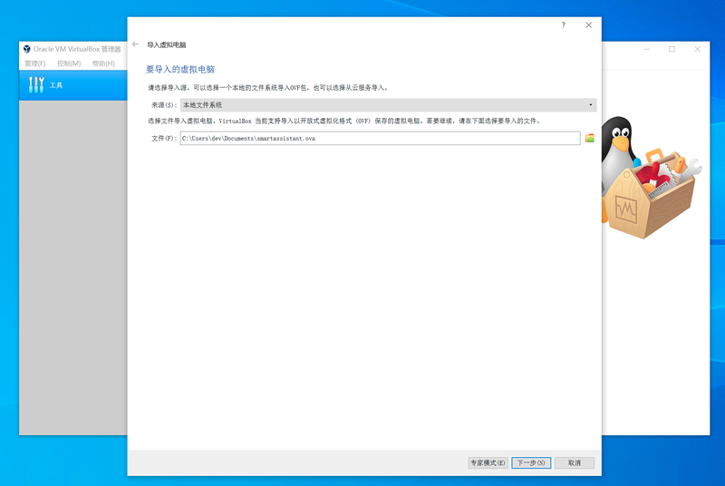

在下一个对话框界面中点击“导入”，稍等片刻即可导入成功

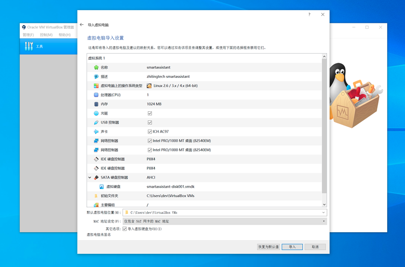

然后在管理器界面中会增加一个名为“smartassistant”的虚拟机，选中，然后点击”启动“。

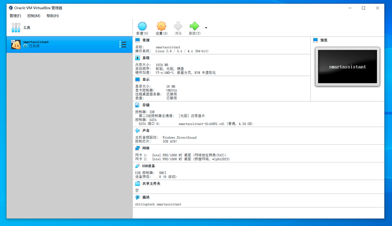

虚拟机启动后可能会提示“物理网卡未找到”，点击“更改网络设置”，配置主机网卡。

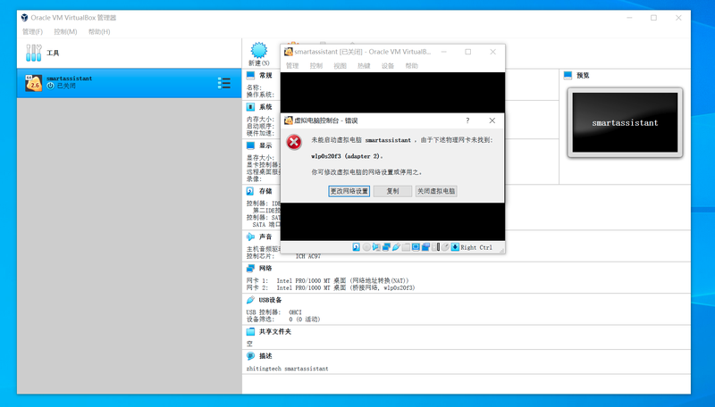

虚拟机启动后会自动通过DHCP协议请求获取IP，接入家庭局域网，然后启动智汀家庭云。

## 通过智汀APP添加并初始化智汀家庭云

首先确保手机已连接WIFI，并且跟电脑是同一个局域网，然后启动智汀APP。

点击“添加智能设备”，智汀APP将会扫描局域网内的智汀家庭云设备，包括上面启动的虚拟机系统。

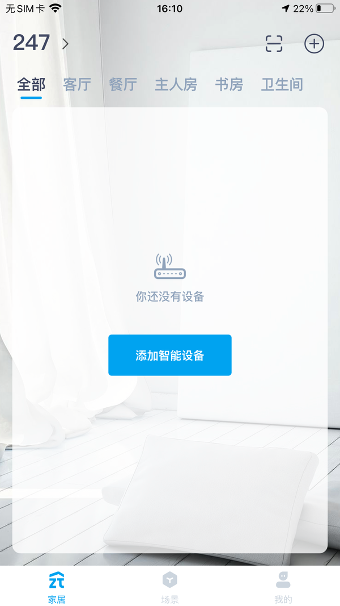

如无意外，设备列表中会出现ID为 620123456789 的设备,点击“添加”按钮，然后按提示进行操作。

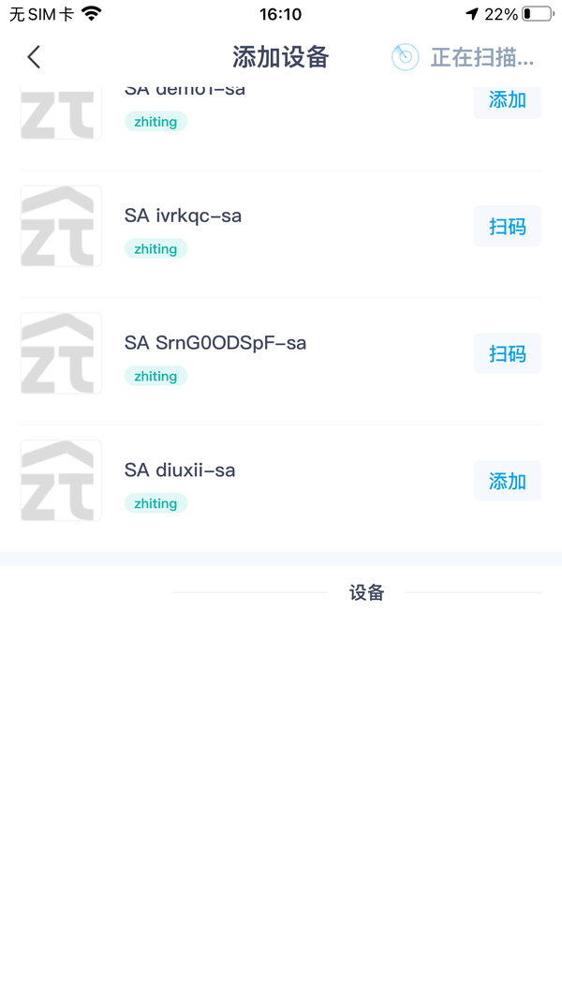

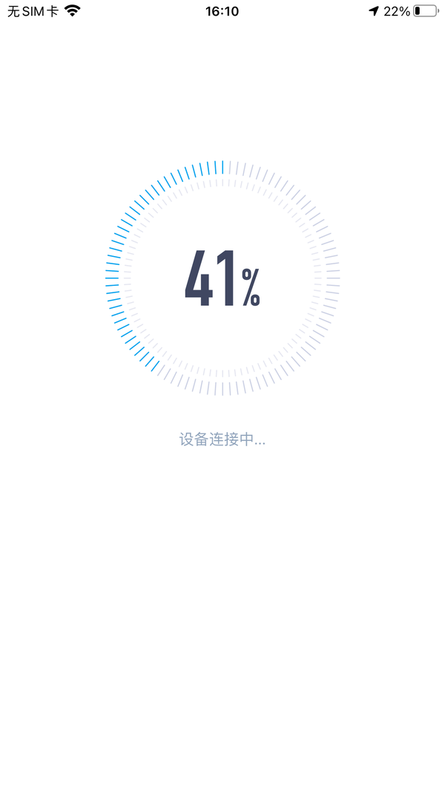

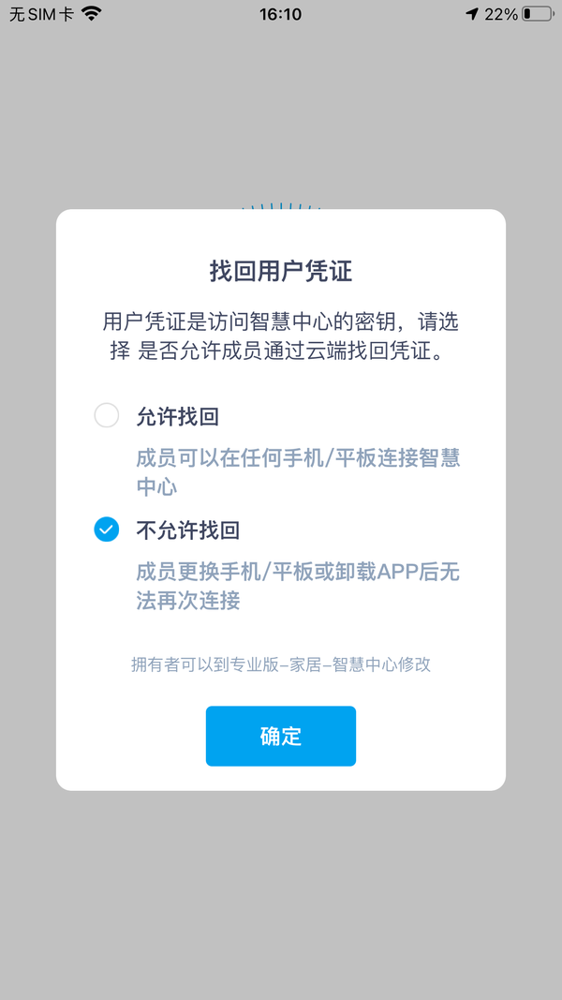

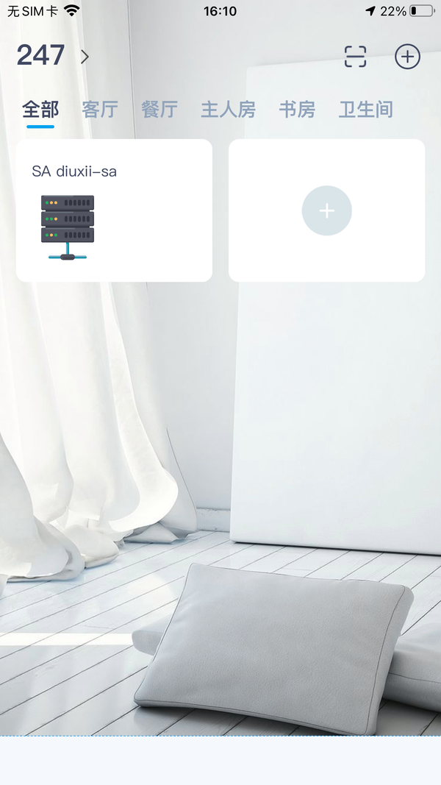

点击**支持品牌**，界面中会列出SA内置的一些插件

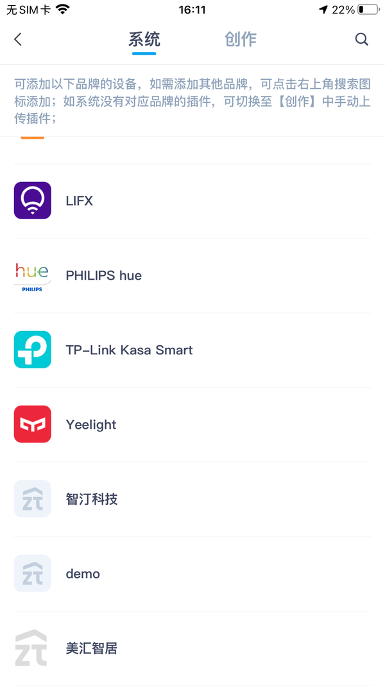

点击demo插件，点击**添加**对插件进行安装，demo插件提供虚拟设备供用户体验。

插件添加成功后，返回到首页 **家居** ，点击右上角 **+** 按钮就可以添加插件支持的设备

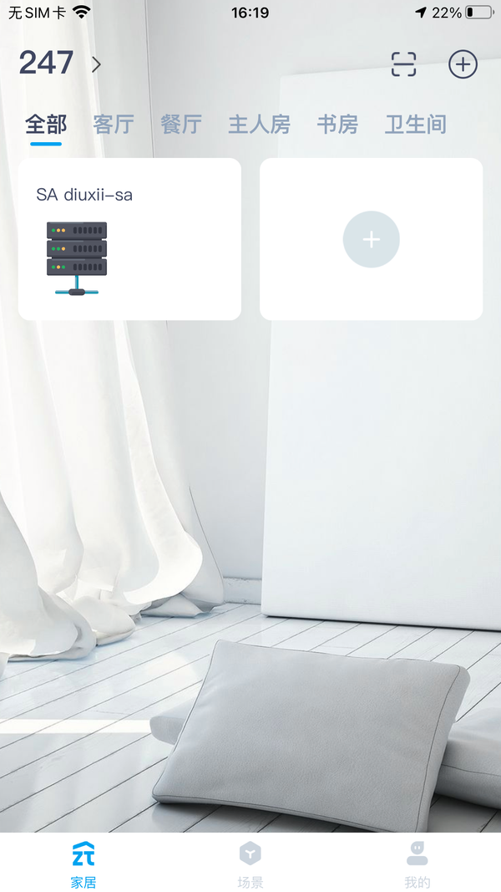

选中其中的一个设备点击**添加**,添加完成后返回到首页的**家居**即可对设备进行操控

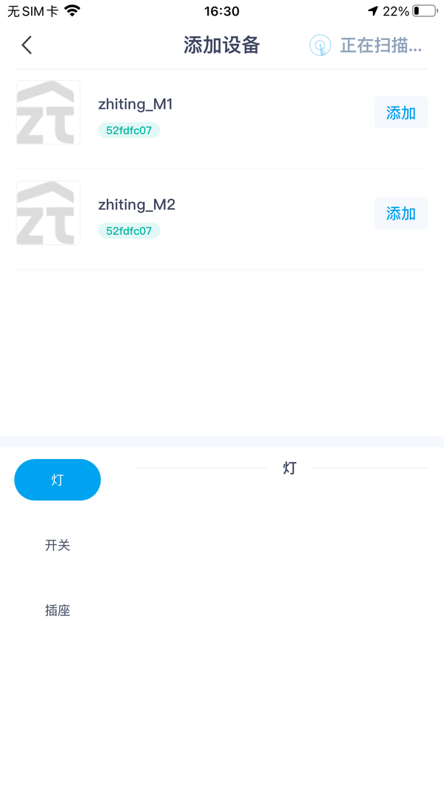

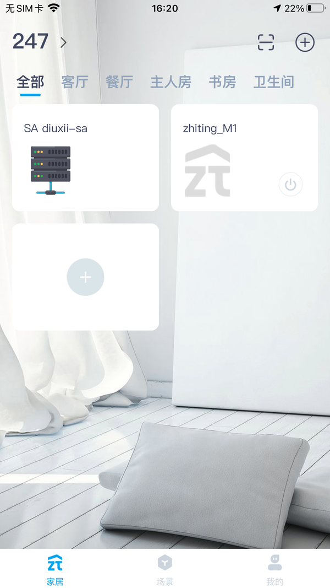

## 回顾

恭喜您，已完成一次最简单的智汀家庭云体验之旅，通过上面的操作，您已经可以让智汀家庭云以虚拟机的形式在您的电脑上运行起来，并且通过安装demo插件，体验智汀家庭云设备添加与操作流程。

接下来，您还可以：

* 购买智能家居硬件（灯，开关），接入智汀家庭云
* 购买智汀家庭云主机，摆脱虚拟机的限制，让您的智能家居7*24稳定运行
* 体验场景任务功能，让家居真正智能起来